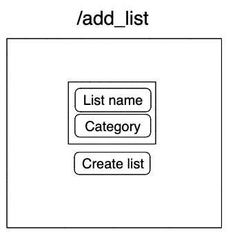

# Todo_List

A todo list built in Ruby/Sinatra/PSQL

## User Stories:
```
As a User
I want to be able to signup
So that I can use the app

As a User
I want to be able to login
So that I can create and edit my lists

As a User
I want to be able to add tasks to my list
So that I can keep track of what I need to do

As a User
I want to be able to tick tasks off
So that I can keep track of what I still need to do

As a User
I want to be able to add a desired completion date
So that I can know how long I have left to complete a task

As a User
I want to be able to save links
So that I can easily access sites relevant to the task

As a User
I want to be able to make multiple lists
So that I can group my tasks

As a User
I want to be able to give my lists categories
So that I can more easily identify and group my 

As a User
I want to be able to colour-code my lists
So that I can more easily identify my lists

As a User
I want to be able to archive old lists
So that my page is not cluttered
```

# Set up
1. Clone this Repo
2. Run `bundle install` to install necessary gems
3. Creating the development database:
    1. Launch postgres in your terminal with `psql`
    2. Run `CREATE DATABASE todo_list;`
    3. Run `\c todo_list;` to connect to the database
    4. Run the query in `01_create_users_table.sql`
    5. Run the query in `02_create_todo_list_table.sql`
    6. Run the query in `03_create_task_table.sql`
4. To create the test database, repeat step 3, but for 3.2 run`CREATE DATABASE todo_list_test;`

# Running the app
1. Enter `rackup` in the terminal
2. Visit `localhost:9292` in your browser

# Planning

## Trello and tables
- [Trello board](https://trello.com/b/hUZHG7OY/todo-list)
- [Tables](https://docs.google.com/spreadsheets/d/1alQawtbhP6UB3flHBr7vVS9H5snEYJQE-vKwF-dI-1s/edit#gid=0)

## Wireframes





